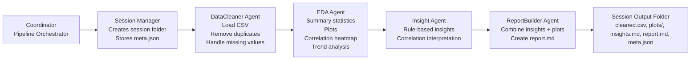

# **BI-Agent: Automated Multi-Agent Business Intelligence Pipeline**  
### *Google AI Agents Intensive — Capstone Project (Enterprise Agents Track)*

---

## 🏗 **Architecture Diagram**



---

## **1. Project Overview**

This BI Agent system automates a full end-to-end analytics workflow:

- Clean raw CSV data  
- Generate descriptive statistics  
- Perform EDA with visualizations  
- Extract business insights  
- Build a final markdown report  
- Save everything in a reproducible session folder  

---

## **2. Repository Structure**

```
bi-agent-capstone/
│
├── demo_data/          
├── docs/               
├── logs/               
├── notebooks/          
├── outputs/            
├── sessions/           
│
└── src/
    ├── agents/         
    ├── coordinator.py  
    ├── session_manager.py
    └── utils.py
```

---

## **3. Installation**

```bash
git clone https://github.com/<your-username>/bi-agent-capstone.git
cd bi-agent-capstone

python -m venv venv
venv\Scripts\activate   # Windows
# or
source venv/bin/activate  # Mac/Linux

pip install -r requirements.txt
```

---

## **4. Run the Pipeline**

```bash
python src/coordinator.py --file demo_data/sales_sample.csv
```

This generates:

```
sessions/<session_id>/
│
├── cleaned.csv
├── insights.md
├── report.md
├── meta.json
└── plots/
```

---

## **5. Jupyter Notebook Demo (Kaggle-Ready)**

Open:

```
notebooks/demo_notebook.ipynb
```

Notebook demonstrates:

- End-to-end pipeline  
- Reading meta.json  
- Insights rendering  
- Plot visualization  
- Final report preview  

---

## **6. Multi-Agent Architecture**

### 🧹 **DataCleaner Agent**
- Removes duplicates  
- Fills missing values  
- Saves cleaned.csv  

### 📊 **EDA Agent**
- Summary statistics  
- Distribution plots  
- Correlation heatmap  
- Trend analysis  

### 💡 **Insight Agent**
- Rule-based business insights  
- Correlation interpretation  
- Creates insights.md  

### 📝 **ReportBuilder Agent**
- Combines stats, plots & insights  
- Builds final report.md  

### 📁 **Session Manager**
- Creates reproducible sessions  
- Stores meta.json for tracking  

### 🧾 **Logger**
- JSON structured logs  
- Full auditability  

---

## **7. Example Output**

```
sessions/20251115_232522/
│
├── cleaned.csv
├── insights.md
├── report.md
└── plots/
```

---

## **8. Features Demonstrated (Matches Kaggle Requirements)**

✔ Multi-agent system  
✔ Sequential agent execution  
✔ Session & state management  
✔ Logging & observability  
✔ Context-safe pipeline  
✔ Fully reproducible  
✔ Notebook demonstration  

---

## **9. License**

MIT License

---

## **10. Credits**

Created for: **Google AI Agents Intensive — Kaggle Capstone Project (2025)**  
Author: **Rishabh Gupta**
